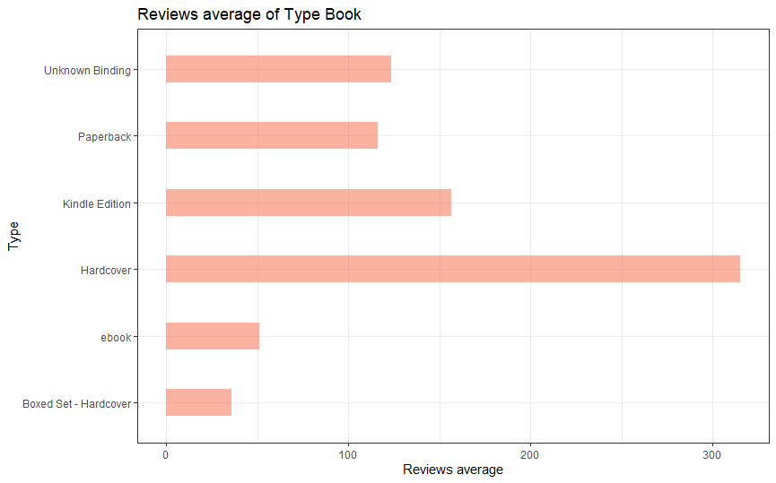
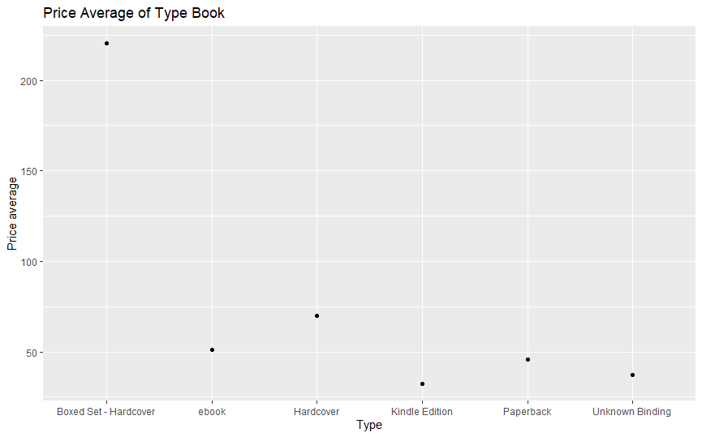

# R-Assignment 4

**Created by Wasin Sukeesup (ID: 63130500104)**

Choose Dataset:
1. Top 270 Computer Science / Programing Books (Data from Thomas Konstantin, [Kaggle](https://www.kaggle.com/thomaskonstantin/top-270-rated-computer-science-programing-books)) >> [Using CSV](https://raw.githubusercontent.com/safesit23/INT214-Statistics/main/datasets/prog_book.csv)

### Outlines
1. Explore the dataset
2. Learning function from Tidyverse
3. Transform data with dplyr and finding insight the data
4. Visualization with GGplot2

## Part 1: Explore the dataset

```
# Library
library(dplyr)
library(readr)
library("ggplot2")
library(forcats)

#Load data
books <- read_csv("https://raw.githubusercontent.com/safesit23/INT214-Statistics/main/datasets/prog_book.csv")
```

This dataset holds a list of 270 books in the field of computer science and programming related topics.
The list of books was constructed using many popular websites which provide information on book ratings an of all the book in those websites the 270 
most popular were selected.


## Part 2: Learning function from Tidyverse

- Function `fct_lump()` from package [forcats](https://forcats.tidyverse.org/articles/forcats.html)). It using for collapsing the least/most frequent values of a factor into “other”.
- Function `fct_infreq()` from package [forcats](https://forcats.tidyverse.org/articles/forcats.html)). It using for reordering a factor by the frequency of values.

```
books %>% mutate(Type = fct_lump(Type,n=4))
ggplot(aes(x = fct_infreq(Type),y = n)) + geom_bar(stat="identity")
```
** You can sepearate this part or combine in part of `Transform data with dplyr and finding insight the data`

## Part 3: Transform data with dplyr and finding insight the data

1 What is the average review of each book type?
```
books %>% mutate(Type = fct_lump(Type,n=5)) %>%  group_by(Type) %>%
  summarise(mean = mean(Reviews, na.rm = TRUE))
```

Result:

```
  Type                   mean
  <fct>                 <dbl>
1 Boxed Set - Hardcover  36  
2 ebook                  51.4
3 Hardcover             315. 
4 Kindle Edition        156. 
5 Paperback             116. 
6 Unknown Binding       124. 
```
//Explain

- list 1
- list 2


2 What is the average price of each book type?

```
books %>% mutate(Type = fct_lump(Type,n=5)) %>%  group_by(Type) %>%
  summarise(Price = mean(Price, na.rm = TRUE))
```

Result:

```
    Type                  Price
  <fct>                 <dbl>
1 Boxed Set - Hardcover 220. 
2 ebook                  51.4
3 Hardcover              70.1
4 Kindle Edition         32.4
5 Paperback              45.8
6 Unknown Binding        37.2
```
//Explain

- list 1
- list 2


3 What is the average rating of each book type?

```
books %>% mutate(Type = fct_lump(Type,n=5)) %>%  group_by(Type) %>%
  summarise(Rate = mean(Rating, na.rm = TRUE))
```

Result:

```
  Type                   Rate
  <fct>                 <dbl>
1 Boxed Set - Hardcover  4.49
2 ebook                  4.29
3 Hardcover              4.06
4 Kindle Edition         4.01
5 Paperback              4.06
6 Unknown Binding        3.99

```
//Explain

- list 1
- list 2


4 Find out how many books are Number_Of_Pages less than the average of each type book.

```
books %>% filter(Number_Of_Pages < mean(Number_Of_Pages, na.rm = TRUE)) %>% group_by(Type) %>% count()
```

Result:

```
  Type                n
  <chr>           <int>
1 ebook               5
2 Hardcover          41
3 Kindle Edition     10
4 Paperback         121
5 Unknown Binding     2
```
//Explain

- list 1
- list 2


5 Find out which books have review more than 1500.
```
books %>% select(Book_title,Reviews,Price,Rating) %>% filter(Reviews > 1500)
```

Result:

```
  Book_title                                                                                Reviews Price Rating
  <chr>                                                                                       <dbl> <dbl>  <dbl>
1 The Elements of Style                                                                        3829  9.32   4.17
2 Ghost in the Wires: My Adventures as the World's Most Wanted Hacker                          1658 12.9    3.97
3 Start with Why: How Great Leaders Inspire Everyone to Take Action                            5938 14.2    4.09
4 Algorithms to Live By: The Computer Science of Human Decisions                               1817 14.4    4.15
5 Weapons of Math Destruction: How Big Data Increases Inequality and Threatens Democracy       2093 14.5    3.87
6 The Innovators: How a Group of Hackers, Geniuses and Geeks Created the Digital Revolution    2092 17.2    4.1 
7 The Phoenix Project: A Novel About IT, DevOps, and Helping Your Business Win                 2629 24.3    4.27
8 The Goal: A Process of Ongoing Improvement                                                   2290 37.1    4.05
```
//Explain

- list 1
- list 2


6 How many books have less than 300 Number_Of_Pages and a Reviews of less than 100 by grouping by book type.

```
books %>% filter(Number_Of_Pages < 300 & Reviews < 1000 ) %>% group_by(Type) %>% count()
```

Result:

```
  Type                n
  <chr>           <int>
1 ebook               3
2 Hardcover          10
3 Kindle Edition      3
4 Paperback          50
5 Unknown Binding     2
```
//Explain

- list 1
- list 2


## Part 4: Visualization with GGplot2
### 1.) The bar chart represents the average review of each book type.
```
bookReview_plot <- books %>% mutate(Type = fct_lump(Type,n=5)) %>%  group_by(Type) %>%
  summarise(mean = mean(Reviews, na.rm = TRUE))

bookReview_plot <- bookReview_plot %>% ggplot(aes(x = fct_infreq(Type),y = mean)) + geom_bar(stat="identity", fill="#f68060", alpha=.6, width=.4) +
  coord_flip() + theme_bw()

bookReview_plot + ggtitle("Reviews average of Type Book") + xlab("Type") + ylab("Reviews average")
```
Result:




### 2.) The chart shows the average price of each book type.
```
bookPrice_plot <- books %>% mutate(Type = fct_lump(Type,n=5)) %>%  group_by(Type) %>%
  summarise(Price = mean(Price, na.rm = TRUE))

bookPrice_plot <- bookPrice_plot %>% ggplot(aes(x = Type,y = Price)) + geom_point(mapping = aes(x = Type,y = Price))

bookPrice_plot + ggtitle("Price Average of Type Book") +
  xlab("Type") + ylab("Price average")
```
Result:


